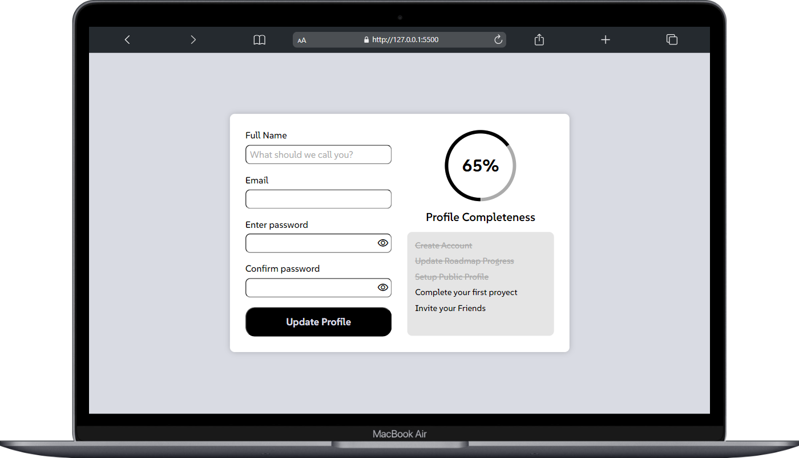

# Accesible Form UI - Solution

Esta es una solución del proyecto **Accesible Form UI** como parte del reto de codificación #RoadMapFrontEnd [RoadMap](https://roadmap.sh/projects/accessible-form-ui). La mejor manera de escribir un buen código es programando todos los días🔥.

  
  

## Requirements
- [x] Fully styled and responsive website
- [x] Consistent color scheme and typography
- [x] Use flexbox, media queries, and grid to create a responsive layout

### Bonus:

- [x] Utilize Google Fonts
- [x] Link to GitHub pages
- [ ] Add dark mode support

### Capturas de pantalla

Diseño adaptado para cualquier tipo de pantalla del dispositivo:

    
🖥️ Desktop version

    
📱 Mobile version

### El proyecto se encuentra alojado en mi repositorio de GitHub:

- [Pagina web](https://miguelramosalarcon.github.io/Accessible-Form-UI-Roadmap/)
- [Codigo fuente]()
- [Link](https://roadmap.sh/projects/accessible-form-ui)
> [!IMPORTANT]
> **“En medio de la dificultad reside la oportunidad."** No dejemos de practicar, esforcémonos por lo que nos apasiona.
